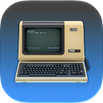
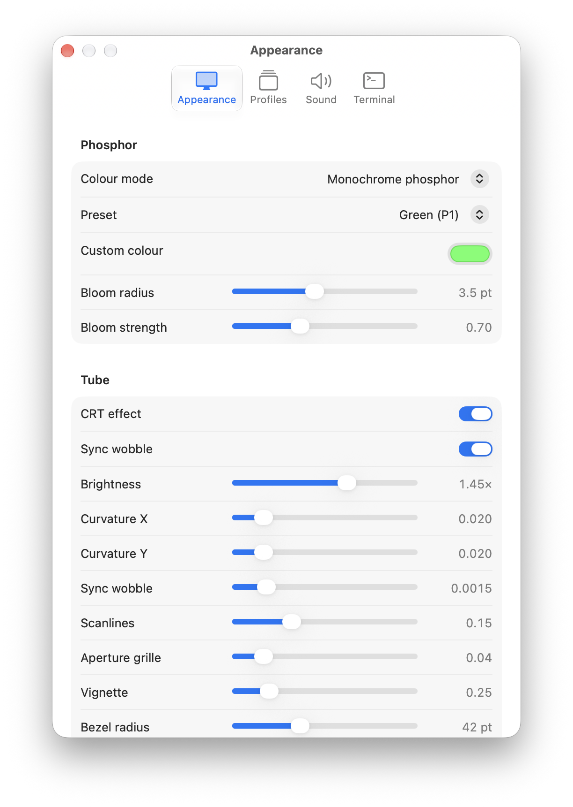
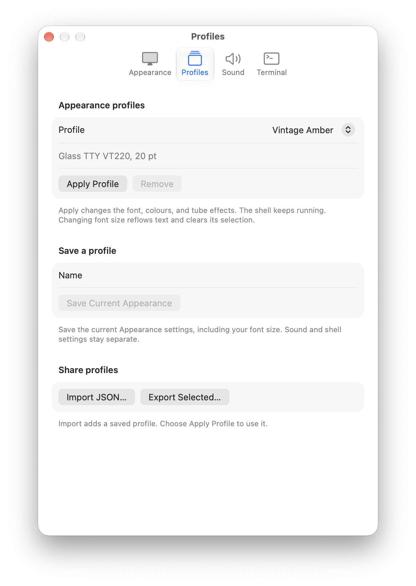
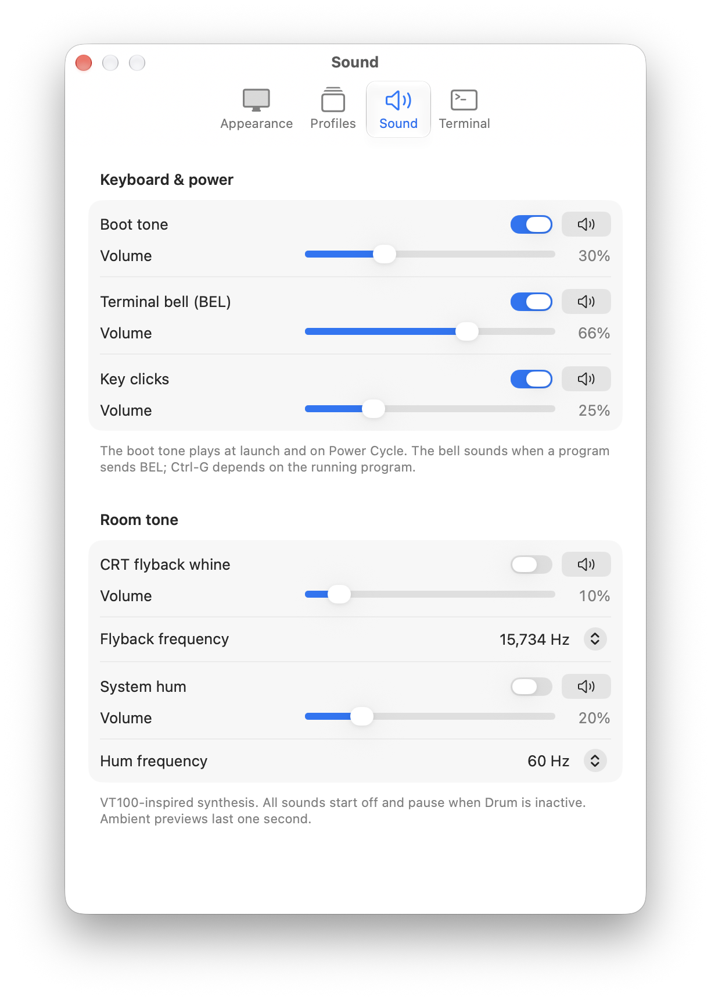

# Drum



A terminal for macOS with a fondness for glowing phosphors, curved glass, and the sound of old hardware.

Drum pays homage to **Cathode**, the old macOS terminal app from Secret Geometry that is no longer available. Cathode made a terminal feel like a piece of living, slightly temperamental hardware. Drum isn't as cool as Cathode, but it's a start.

Cathode's original description put it beautifully:

> “Bask in the glow of over-bright phosphors that flash on and slowly fade away.”

That feeling is the inspiration. Drum is an independent project with its own SwiftUI and Metal renderer, built around [SwiftTerm](https://github.com/migueldeicaza/SwiftTerm).

## What it does

- Runs your login shell in one ordinary, resizable macOS window, with native full-screen support.
- Adds bloom, scanlines, an aperture grille, curvature, vignette, and subtle sync wobble.
- Offers amber, green, white, and custom phosphors, plus a **Preserve Colours** mode for ANSI and true-colour output.
- Includes Glass TTY VT220, IBM VGA 8×16, and system monospace fonts, with quick font zoom.
- Saves complete appearance profiles and imports/exports them as JSON. Vintage Amber, Green Screen, Cool White, and Daily Driver are included.
- Provides optional synthesized boot tones, terminal bells, key clicks, CRT flyback whine, and system hum. Sounds start off and pause when Drum is inactive.
- Lets you turn CRT effects off while keeping the same running shell.

Drum is an early project. Cathode's adjustable bit rate, transparency, noise, flicker, and slowly fading phosphor persistence are inspirations for the future; they aren't features of Drum today. Tabs and split panes are also outside the current scope.

## Screenshots

<p>
  <a href="docs/images/appearance.png"></a>
  <a href="docs/images/profiles.png"></a>
  <a href="docs/images/sound.png"></a>
</p>

Appearance, profiles, and sound settings. Click an image to see it at full size.

## Build and run

Drum requires **macOS 26 or later**, **Xcode 26 or later** with the macOS 26 SDK (or newer), the **Metal Toolchain**, and [XcodeGen](https://github.com/yonaskolb/XcodeGen). The project uses Swift 6 with complete strict concurrency checking. The latest local verification used Xcode 27.0 on Apple silicon.

Install XcodeGen through Homebrew if needed:

```sh
brew install xcodegen
```

Select your installed Xcode under **Xcode → Settings → Locations → Command Line Tools**. Install its Metal Toolchain if needed:

```sh
xcodebuild -downloadComponent MetalToolchain
```

Then clone and generate the project:

```sh
git clone https://github.com/welshofer/Drum.git
cd Drum
xcodegen generate
open Drum.xcodeproj
```

Select the **Drum** scheme, choose **My Mac**, and run. Debug and Release use ad-hoc signing; an Apple Developer membership is not needed for a local build. Swift Package Manager downloads the dependencies on the first build.

SwiftTerm includes a build-information plugin. Review the plugin at the revision in `Package.resolved` before approving Xcode's trust prompt. A command-line build can use `-skipPackagePluginValidation` for that invocation after review; the normal build below retains validation:

```sh
xcodebuild -project Drum.xcodeproj -scheme Drum \
  -configuration Debug -destination "platform=macOS,arch=$(uname -m)" \
  -disableAutomaticPackageResolution -onlyUsePackageVersionsFromResolvedFile build
```

`project.yml` is the project source of truth. Regenerate with XcodeGen after changing project configuration; don't hand-edit the generated project.

## Using Drum

Open **Drum → Settings…** (⌘,) to tune the picture, apply/save a profile, or enable sounds. Imported profiles are added to your saved list; choose **Apply Profile** to use one. Profiles contain appearance settings only and keep your shell and sound settings intact.

| Shortcut | Action |
| --- | --- |
| ⌘+ / ⌘− | Increase / decrease font size |
| ⌘0 | Reset the selected font to its recommended size |
| ⌘R | Power cycle the picture while the shell keeps running |
| ⌘⇧R | Retry a failed shell launch, when available |

Font size stays within 8–48 pt. Font changes reflow text and clear its selection while preserving the running process and terminal modes. Reduce Motion pauses sync wobble.

Drum runs real shell commands with your user account's normal permissions. It is not sandboxed. Terminal-origin clipboard access is disabled by default; see the Terminal settings before opting in.

## Development

See [CONTRIBUTING.md](CONTRIBUTING.md) for checks and project conventions. [drum-spec.md](drum-spec.md) describes the current scope and acceptance gates; [CLAUDE.md](CLAUDE.md) records implementation invariants.

The existing AppIntents metadata tooling warning remains unresolved. Regression tests are useful evidence, but physical-display readability, real IME/VoiceOver interaction, and presentation performance still need their specified acceptance checks. Screenshots do not establish those results.

Developer ID signing, notarization, and downloadable-app distribution are documented in [docs/distribution.md](docs/distribution.md). Those are separate from building or sharing the source; no notarized release is claimed here.

## License and credits

Drum's original code and documentation are available under the [MIT License](LICENSE). Third-party components retain their own licenses:

- **SwiftTerm:** MIT, with its complete notice in [THIRD_PARTY_NOTICES.md](THIRD_PARTY_NOTICES.md).
- **Glass TTY VT220:** The Unlicense.
- **IBM VGA 8×16:** CC BY-SA 4.0, redistributed unmodified with attribution.

See [CREDITS.md](CREDITS.md) and the [bundled font licenses](Drum/Resources/Fonts/). Cathode is credited as inspiration; the project does not include Cathode's code or assets.
